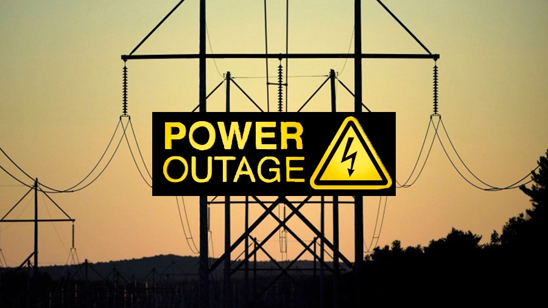

# Gediz-Elektrik-Power-Outage-SQL-Case-Study

 

## Business Problem

According to the service standards prepared by the Energy Market Regulatory Authority (EPDK), which regulates the electricity distribution sector, Electricity Distribution Companies are responsible for restoring service in the event of a power outage, and they may face penalties if the outage continues beyond the specified limits.

In this context, Electricity Distribution Companies have developed and continue to develop various procedures for the instant and/or rapid detection of outages.

With the provided dataset, there is a request to develop a predictive approach for forecasting **"fault"** or **"outage"** work orders that may occur in the network centers under the responsibility of GDZ Electricity Distribution Inc.

## Dataset Story

The dataset named **"gediz_elektrik_2021_2022_kesinti.csv"** contains work orders reflected in the TSKS system for outages that occurred in the service region of GDZ Electricity Distribution Inc. covering **Izmir** and **Manisa** provinces between 01/01/2021 and 31/12/2021. Before conducting a data analytics study, a review and analysis of the dataset are performed in Excel for data cleaning and gaining a general overview of the dataset.

## Features of Dataset

- **Total Features :** 24
- **Total Row :** 114.983
- **CSV File Size :** 16.4 MB

## Variable Descriptions

`ID_NO`: It is the unique number assigned to each outage record opened in the TSKS system.

`İL`:  It indicates the city where the outage record was opened.

`İLÇE`: It specifies the district where the outage record was opened.

`ŞEBEKE_UNSURU`: It indicates the network element where the interruption occurs when an interruption record is created.

`KESİNTİ_NEDENİNE_İLİŞKİN_AÇIKLAMA`: It is the reason for the interruption selected from the list in the created interruption record.

`KAYNAĞA_GÖRE`: It indicates the type of line where the interruption occurred.

`SÜREYE_GÖRE`: It indicates whether the interruption duration is long or short based on the specified constraint.

`SEBEBE_GÖRE`:  It is selected from External/ Security/Network Operator options.

`BİLDİRİME_GÖRE`: It indicates whether the interruption record was created with or without a call when the record was made.

`BAŞLAMA_TARİHİ_VE_ZAMANI`: It is the date/time indicating when the interruption record was created in the TSKS system and when the interruption started.

`SONA_ERME_TARİHİ_VE_ZAMANI`: It indicates the date/time when the work order, created under the interruption record, was closed by the assigned field team in INFOR EAM.

`KESİNTİ_SÜRESİ`: Mathematically, it is **"END_DATE_AND_TIME" - "START_DATE_AND_TIME"**. It is the value that indicates the duration in hours between the moment the work order created for the interruption in INFOR EAM is closed and the time the interruption record was created.

`KENTSEL_OG`: The middle voltage outage line count in town centers of districts with a population of 50,000 and above according to the population data announced by TÜİK in 2020.

`KENTSEL_AG`: The low voltage outage line count in town centers of districts with a population of 50,000 and above according to the population data announced by TÜİK in 2020.

`KENTALTI_OG`: The medium voltage outage line count in the central neighborhoods of non-urban districts with a population of 2,000 and above according to the population data announced by TÜİK in 2020.

`KENTALTI_AG`: The number of low voltage outage lines in the central neighborhoods of non-urban districts and in neighborhoods with a population of 2,000 or more according to the population data announced by TÜİK in 2020.

`KIRSAL_OG`: The medium voltage line count in the central neighborhoods of non-urban districts with a population below 2,000 according to the population data announced by TÜİK in 2020.

`KIRSAL_AG`: The low voltage line count in the central neighborhoods of non-urban districts with a population below 2,000 according to the population data announced by TÜİK in 2020.

`TOPLAM_KENTSEL_OG`: The total outage duration in the middle voltage lines of town centers in districts with a population of 50,000 and above according to the population data announced by TÜİK in 2020, measured in hours.

`TOPLAM_KENTSEL_AG`: The total outage duration in the low voltage lines of town centers in districts with a population of 50,000 and above according to the population data announced by TÜİK in 2020, measured in hours.

`TOPLAM_KENTALTI_OG`: The total outage duration in the middle voltage lines of central neighborhoods in non-urban districts with a population of 2,000 and above according to the population data announced by TÜİK in 2020, measured in hours.

`TOPLAM_KENTALTI_AG`: The total outage duration in the low voltage lines of central neighborhoods in non-urban districts with a population of 2,000 and above according to the population data announced by TÜİK in 2020, measured in hours.

`TOPLAM_KIRSAL_OG`: The total outage duration in the middle voltage lines of central neighborhoods in non-urban districts with a population below 2,000 according to the population data announced by TÜİK in 2020, measured in hours.

`TOPLAM_KIRSAL_AG`: The total outage duration in the low voltage lines of central neighborhoods in non-urban districts with a population below 2,000 according to the population data announced by TÜİK in 2020, measured in hours.
